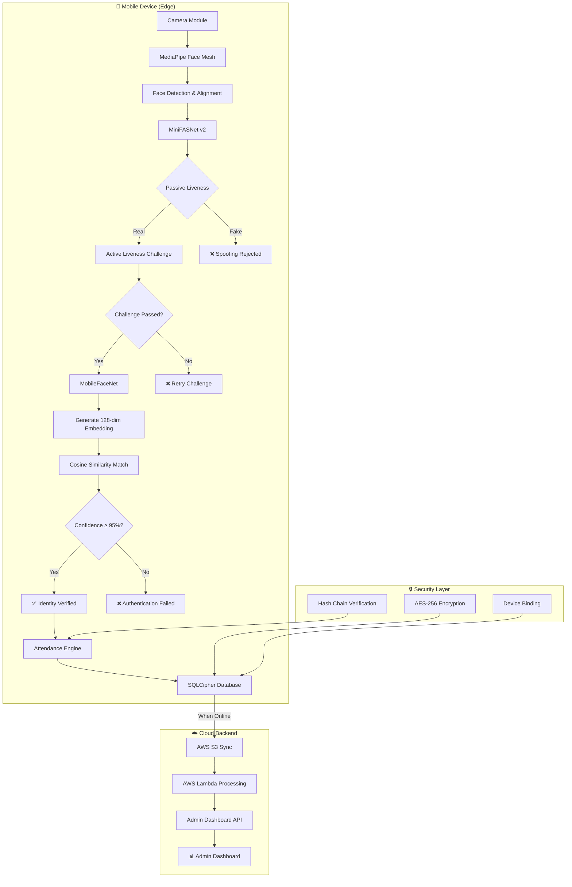
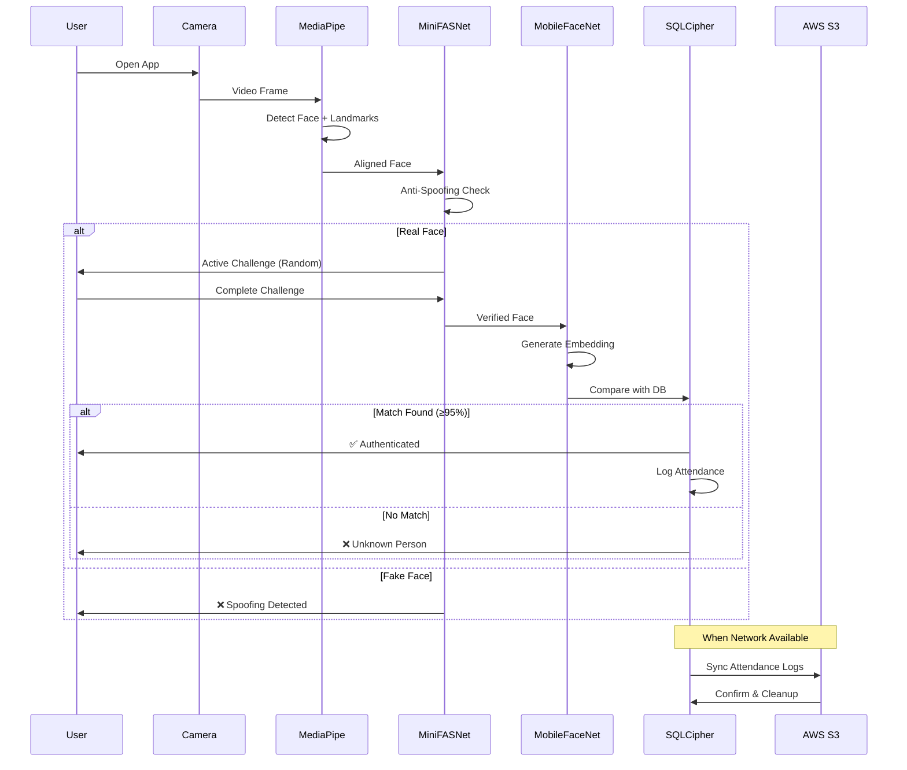
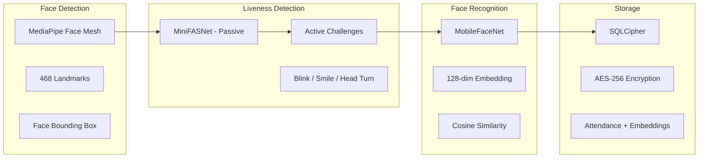
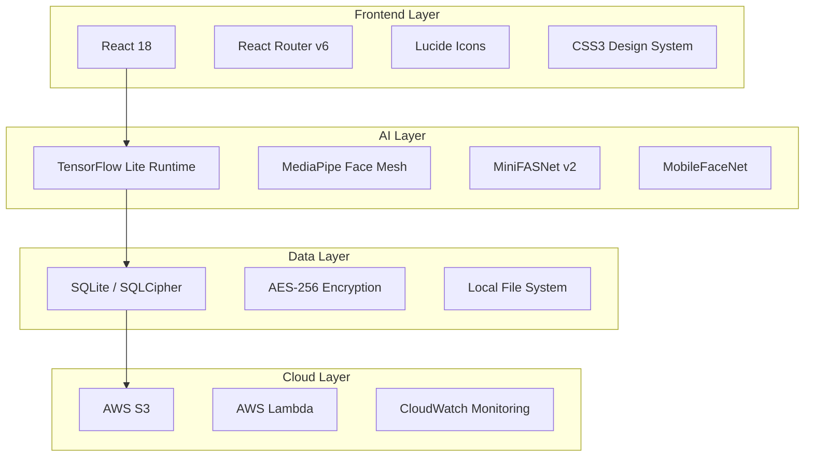

# 🏗️ Architecture — NHAI Offline Face Authentication System

## System Architecture Diagram



## Data Flow Architecture



## Module Architecture



## Technology Stack Diagram



## Security Architecture

| Layer | Technology | Purpose |
|-------|-----------|---------|
| Storage Encryption | SQLCipher + AES-256 | Encrypt database at rest |
| Data Isolation | Device Binding | Lock data to specific device |
| Tamper Detection | Hash Chain | Detect attendance record modifications |
| Anti-Spoofing | MiniFASNet + Active Challenges | Prevent photo/video/mask attacks |
| Transfer Security | TLS 1.3 | Encrypt data in transit to cloud |
| Access Control | Face + Liveness | Multi-factor biometric authentication |

## Deployment Architecture

```
Production Deployment:

┌────────────────────┐     ┌────────────────────┐
│   Field Device 1   │     │   Field Device N   │
│  (Android/iOS)     │     │  (Android/iOS)     │
│  - TFLite Models   │     │  - TFLite Models   │
│  - SQLCipher DB    │ ... │  - SQLCipher DB    │
│  - Offline First   │     │  - Offline First   │
└────────┬───────────┘     └────────┬───────────┘
         │                          │
         │    When Online           │
         ▼                          ▼
┌──────────────────────────────────────────────┐
│              AWS Cloud Backend               │
│  ┌──────────┐  ┌──────────┐  ┌───────────┐  │
│  │  S3      │  │  Lambda  │  │  Admin    │  │
│  │  Bucket  │──│  Process │──│  Dashboard│  │
│  └──────────┘  └──────────┘  └───────────┘  │
└──────────────────────────────────────────────┘
```
